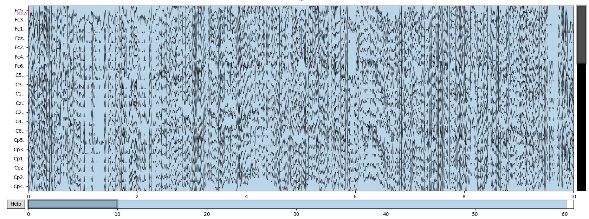
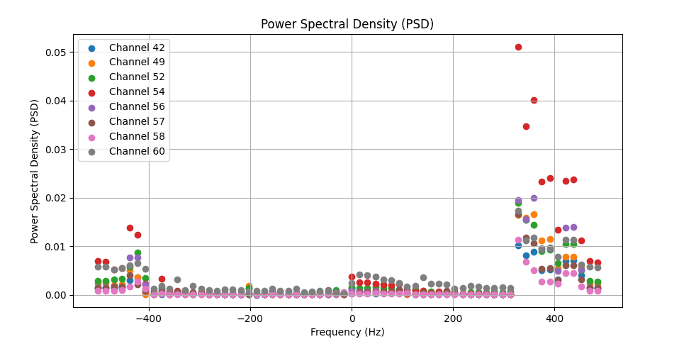
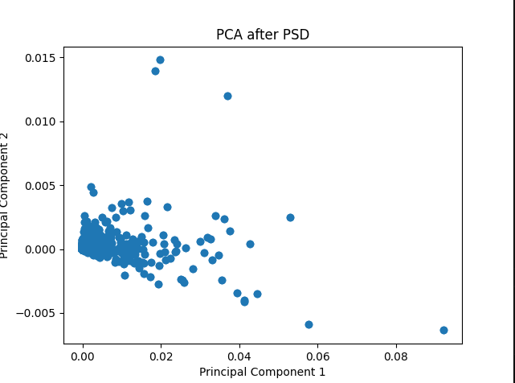
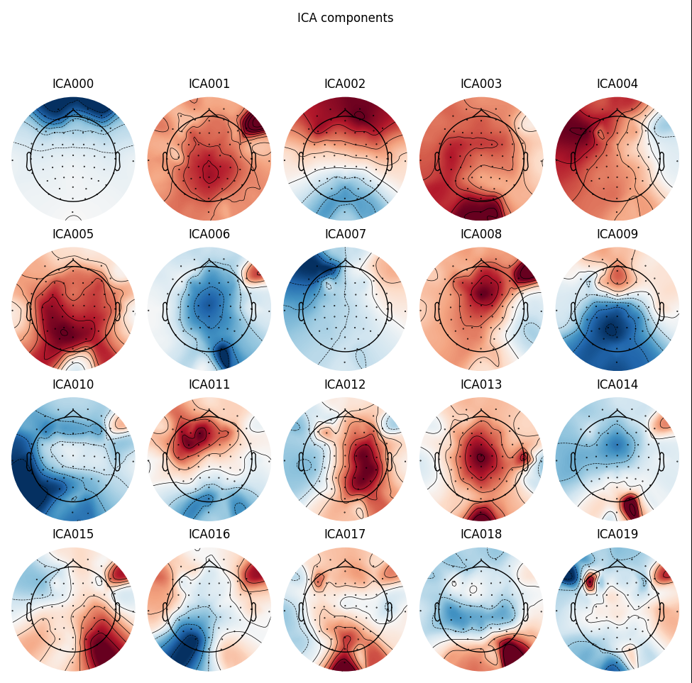
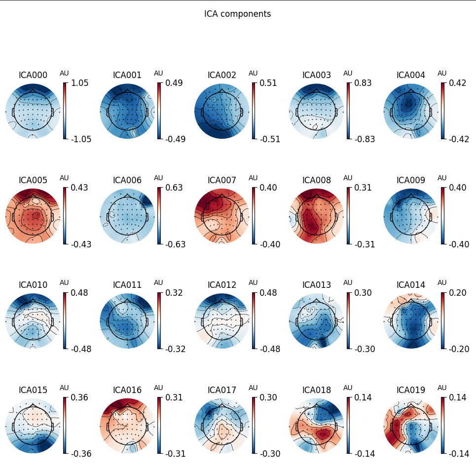

  # Total-Perspective-Vortex
  This subject aims to create a brain computer interface based on electroencephalographic data (EEG data) with the help of machine learning algorithms. Using a subject’s EEG reading, it infers what he or she is thinking about or doing - (motion) A or B in a t0 to tn timeframe. The data was mesured during a motor imagery experiment, where people had to do or imagine a hand or feet movement.
  
  #Environment - conda activate tpv - 
  - numpy
  - pandas
  - mne!=0
  
  #Data
    - experimental protocol
        https://physionet.org/content/eegmmidb/1.0.0/
    - loading data  
    
    

  #Parsing and filtering
  -  Mapping
  -  Filtering to reduce noise and artifacts (blinkings, heartbeats...)
  -  Frequency Fourrier Transformation (fft) to transform to frequency domaine from time domaine    

  - Power Spectral Density - PSD

        Channels with stronger PSD often indicate higher activity in certain frequency bands.
        These channels may correspond to regions of interest or brain areas that are more
        active during the recording.
    
   

  #Dimension Reduction  
    - PCA :
        
        When performing PCA, the components (new features) are linear combinations of these original chanels.
        In PCA, the goal is often to reduce the dimensionality of the data while retaining as much relevant
        information as possible. When a specific number of components are choosen (e.g., 2 components for a 2D scatter plot),
        it reduce the data to that lower-dimensional space.
        
  

  - ICA :
          ICA aims to find a transformation that maximizes the statistical independence of the components
    derived from the mixed observed signals
    - whitening
      -     Covariance Matrix Estimation: the covariance matrix of the observed data is estimated.
            This matrix describes the statistical relationships (covariances) between different channels
            or features.
      -     Whitening Transformation: The estimated covariance matrix is used to perform a transformation
            on the data that "whitens" it. Whitening is a linear transformation that makes the transformed
            data have an identity covariance matrix, i.e., the transformed data has uncorrelated components
            and unit variance. This is often achieved using methods like Cholesky decomposition or the
            square root of the inverse of the covariance matrix.
    
        
    - ica.fit() in MNE
      
          ICA_components_after_frequency_fourrier_transformation:

        Frequency Fourrier Transformation transform data to frequency domqine from time dommaine
    

    - Passing the n_components largest-variance components to the ICA algorithm to obtain the unmixing matrix 
    - Correlation
    -  χ² (Khi²)
  #Pipeline object scikit-learn

  #Data stream classification in real time
